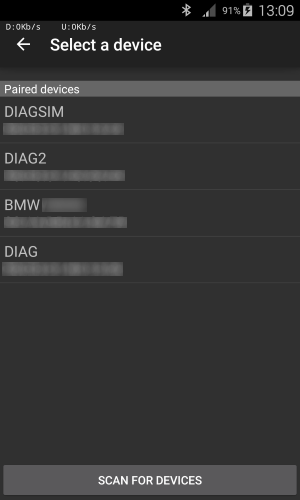
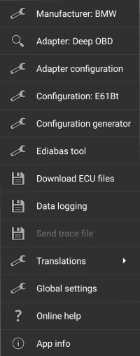
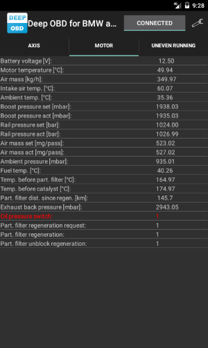
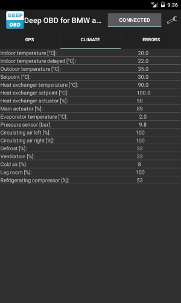
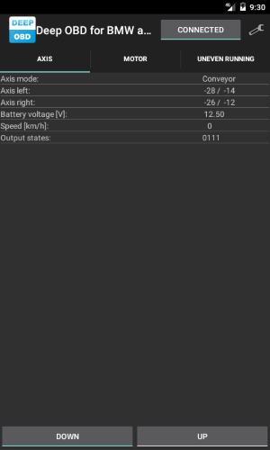

# Deep OBD for BMW and VAG
This page describes how to use _Deep OBD for BMW and VAG_.  
Download app from Google Play: [https://play.google.com/store/apps/details?id=de.holeschak.bmw_deep_obd](https://play.google.com/store/apps/details?id=de.holeschak.bmw_deep_obd)  
Table of contents:
* [Manufacturers](#manufacturers)
* [Supported adapters](#supported-adapters)
* [First start](#first-start)
* [The main menu](#the-main-menu)
	* [Configuration generator](Configuration_Generator.md)
	* [HowTo create Deep OBD for BMW and VAG pages](Page_specification.md)
	* [Ediabas tool](EdiabasTool.md)
* [Log and trace files location](#log-and-trace-files-location)
* [Background image](#background-image)

## Manufacturers
Basically _Deep OBD for BMW and VAG_ can operate in two modes, either BMW or VAG. You have to select the car manufacturer first. The VAG group mode (VW, Audi, Seat, Skoda) is still experimental and only supports the protocols KPW2000, KWP1281 and TP2.0. A [Replacement firmware for ELM327](Replacement_firmware_for_ELM327.md) adapter is required for this mode.

## Supported adapters
_Deep OBD for BMW and VAG_ supports several OBD II adapters:
* Standard FTDI based USB "INPA compatible" D-CAN/K-Line adapters (all protocols)
* ELM327 based Bluetooth and WiFi adapters. Recommended ELM327 versions are 1.4b, 1.5 and origin 2.1, which are based on PIC18F2480 processor (no MCP2515 chip) (D-CAN protocol only) 
* Custom [Bluetooth D-CAN/K-Line adapter](Build_Bluetooth_D-CAN_adapter.md) (BMW-FAST protocol over D-CAN and K-Line)
* ELM327 based adapters with [Replacement firmware for ELM327](Replacement_firmware_for_ELM327.md) D-CAN and K-Line (all protocols!). When VAG has been selected as manufacturer, only this adapter could be used.
* [ENET WiFi adapters](ENET_WiFi_Adapter.md) (for BMW F-models)

## First start
At the first start of Deep OBD for BMW and VAG you will be asked to download the ECU files. The file package is very large (100MB) and requires approximately 1GB on the external SDCard after extraction. When using VAG as manufacturer a different ECU package is required.  
In the next step a configuration _(*.cccfg file)_ must be created. The easiest way to do so is to use the [configuration generator](#ConfigurationGenerator). For complex scenarios you could manually create configuration files (see [HowTo create Deep OBD pages](Page_specification.md)). After loading and compiling the configuration file, all tabs included in the file will be visible on the main page.  
Before connecting to the vehicle via Bluetooth a [Bluetooth adapter](Build_Bluetooth_D-CAN_adapter.md) has to be selected (or you will be asked when connecting). It's recommended to pair the adapter in the android Bluetooth menu before using it in _Deep OBD for BMW and VAG_, because this way a connection password could be assigned.

 

## The main menu
The application has a configuration menu with the following options:
* _Manufacturer_: Select the car manufacturer with this menu point first. The default is BMW, the other manufacturers are from the VAG group (VW, Audi, Skoda). The VAG mode is still experimental and requires a [Bluetooth D-CAN/K-Line adapter](Build Bluetooth D-CAN adapter.md).
* _Device_: With this menu the [Bluetooth adapter](Build_Bluetooth_D-CAN_adapter.md) could be selected.  If the device is not coupled already, searching for new devices is possible. This menu is only enabled if a configuration with _interface_ type _BLUETOOTH_ has been selected.
* _Adapter configuration_: When using a FTDI USB or Bluetooth (non ELM327) adapter, this menu item opens the adapter configuration page. The following settings are available (depending from adapter type):
	* _CAN baud rate_: (500kbit/100kbit) or K-Line (CAN off)
	* _Separation time_: Separation time between CAN telegrams. The default is 0, only change this value if there are communication problems.
	* _Block size_: Size of CAN telegram blocks. The default is 0, only change this value if there are communication problems.
	* _Firmware update_: If a new firmware is available for the adapter, the update could be initiated with this button.
* _Configuration generator_: Simple [XML configuration files](Page_specification.md) could be generated automatically using the informations obtained from the vehicle. This menu opens the [configuration generator](Configuration_Generator.md) which allows to create new or modify existing XML files by simply selecting the ECU and job informations.
* _Configuration_: This menu allows the selection of the [configuration file](Page_specification.md) _(*.cccfg file)_. When using the [configuration generator](Configuration_Generator.md) the configuration is selected automatically. After selection the file will be compiled.
* _Ediabas tool_: This is a port of the tool32.exe windows application. Selecting the menu will open the [Ediabas tool](EdiabasTool.md) page.
* _Storage media_: If the default storage media for the ECU files is not appropriate, a different media could be selected in this sub menu. The application storage directory on the media will be always fixed to _de.holeschak.bmw_deep_obd_.
* _Download ECU files_: Since the BMW ECU files are very large (100MB), they are not included in the application package. When starting the application for the first time the ECU file download is requested automatically. With this menu entry the file download could be initiated manually if the ECU files are damaged.
* _Data logging_: Selecting this menu entry will open a sub menu with multiple data logging options:
	* _Create trace file_: If the checkbox of this menu is active, a _ifh.trc_ file will be created when the application is connected. The trace file will be created in the _Log_ subdirectory.
	* _Append trace file_: If this checkbox is enabled the trace file is always appended. Otherwise the trace file will be overridden after selection of a new configuration or restart of the application.
	* _Log data_: This checkbox enables logging of the display data to a log file. Only those lines are logged, that have a _log_tag_ property in the [configuration file](Page_specification.md). The _logfile_ property in the _page_ node has to be specified as well to activate logging. When using the [configuration generator](#ConfigurationGenerator) _log_tag_ is set by default to the job name and _logfile_ to the ECU name. Data will be logged in the _Log_ subdirectory.
* _Translations_: (Only for non German languages) This menu opens a submenu that allows configuration of automatic ECU text translation with Yandex.Translate:
	* _Translate ECU text_: If this menu item is checked, automatic ECU text translation is active.
	* _Yandex API Key_: For automatic translation with Yantex.Translate a free API Key is required, that allows a limited amount of translations per day. To get this key, a Yandex account is required. This menu provides a GUI that assists in obtaining the API Key.
	* _Clear translation cache_: To enforce a new translation this menu resets the translation cache.
* _Online help_: Displays this help page.
* _App info_: Displays the app version and unique id.

Below are some screenshots from the example E61 configuration:

   

## Log and trace files location
The location of the log and trace files depends from the Android version.  
Beginning with Android KitKat (4.4) writing to the external SdCard is not possible any more. For older Android versions log and trace files are stored in a subdirectory relative to _de.holeschak.bmw_deep_obd_ on the external SDCard. For KitKat and above the data could be found in the directory _Android\data\de.holeschak.bmw_deep_obd\files_ of the external SDCard.  
The standard log files are stored in the subdirectory _Log_, whereas the [Ediabas tool](EdiabasTool.md) uses the subdirectory _LogEdiabasTool_ and the [configuration generator](Configuration_Generator.md) the subdirectory _LogConfigTool_.

## Background image
It's possible to replace the background image. Simply store a custom _Background.jpg_ file in the subdirectory _Images_ of the current _de.holeschak.bmw_deep_obd_ data directory.
