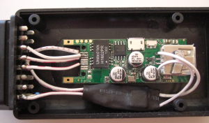
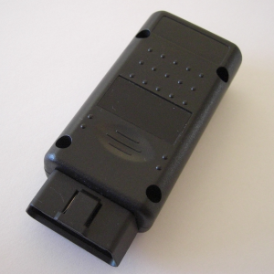
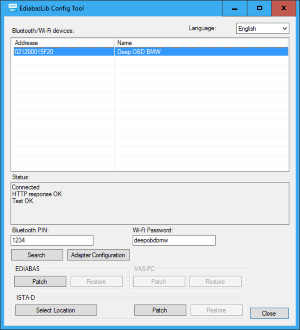

# ENET WiFi Adapter
For the BMW F-models there is a WiFi adapter available, that allows to communicate directly using the BMW ENET protocol.  
It is based on the hardware of an [A5-V11 3G/4G Router](https://wiki.openwrt.org/toh/unbranded/a5-v11). The adapter has the following features:
* MediaTek/Ralink RT5350F processor with 350MHz
* DC/DC converter for improved power consumption
* With additional CPU heat sink for over temperature protection
* [OpenWrt](https://openwrt.org/) operating system
* [LuCi](http://luci.subsignal.org/trac) web interface
* Firmware update possible via web interface
* DHCP server
* ESSID: Deep OBD BMW
* Default Wifi password: deepobdbmw
* Default IP address: 192.168.100.1
* Default root password: root
* At the moment a new power supply concept is in preparation, by replacing the DC/DC converters with a TPS560200, that is able to use a maximum power supply voltage of 17V. The feedback resistors have to be changed to 49.9K/20K and 61.9K/20K because the feedback voltage is different. Additionally one input capacitor has to be replaced with a higher voltage type.

  

## Buy an adapter
New adapters are available.  
You could buy the [ENET WiFi adapter](http://www.ebay.de/itm/252852275333) from EBAY.  
For BMW pre F-models use the [Bluetooth adapter](Replacement_firmware_for_ELM327.md)

## Factory reset
If the adapter gets unreachable after a misconfiguration there is a possibility to perform a factory reset.  
You have to open the adapter and press the reset button after the adapter has booted.

## Use the adapter with INPA, Tool32 or ISTA-D
You could use the Bluetooth adapter on a windows PC with INPA, Tool32 or ISTA-D as a replacement for an ENET adapter cable. The following steps are required to establish the connection:
* Install [.NET framework 4.0](https://www.microsoft.com/de-de/download/details.aspx?id=17718) or higher and [VS2015 C++ runtime](https://www.microsoft.com/de-de/download/details.aspx?id=48145) (recommended, but not required)
* Optionally connect the ENET adapter with the PC. The PC automatically gets an IP address from the adapter DHCP server.
* Download the latest _Binary_ package and extract the .zip file. Start _Api32\EdiabasLibConfigTool.exe_ and follow the instructions in the status window: Search the adapter, select it, optionally click _Connect_, click _Check Connection_ and patch the required EDIABAS installations.
* For ISTA-D: You have to select the _EDIABAS\bin_ directory inside ISTA-D first.
* Optionally you could also open the adapter configuration page in the web browser.
* For ISTA-D: In _Administration_ -> _VCI Config_ select as _Interface type_: _Ediabas default settings (ediabas.ini)_

