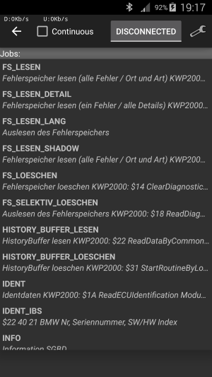
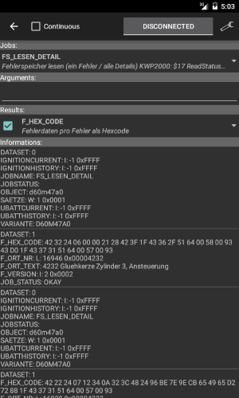

# Ediabas tool
Ediabas tool is a tool32 replacement for Android. It could be reached from the _Ediabas tool_ menu entry of the main menu. This tool allows selection and execution of all ECU file jobs. After opening the tools page a .grp or .prg file has to be selected from the menu.  
The tool options menu has the following entries:
* _Interface_: If a configuration has been loaded on the main page, the same communication interface is also used by the tools as default. With this menu entry a different communication interface could be selected.
* _SGBD (grp)_: Opens a file explorer for selecting a group ECU file. Only files with .grp extension are displayed. After selection the group file the corresponding .prg file is automatically selected if possible. The selected .prg file is displayed in the _SGBD (prg)_ menu entry.
* _SGBD (prg)_: Opens a file explorer for selecting a SGBD ECU file. Only files with .prg extension are displayed.
* _Device_: With this menu the [Bluetooth adapter](Deep_OBD_for_BMW_and_VAG.md#supported-adapters) could be selected. If the device is not coupled already, searching for new devices is possible. This menu is only enabled if interface type _BLUETOOTH_ has been selected.
* _CAN adapter configuration_: When using a FTDI USB or Bluetooth (non ELM327) adapter with this menu the adapter could be configured. Depending on the adapter type only the CAN baudrate/K-Line interface or more specific parameters could be specified.
* _Data logging_: Selecting this menu entry will open a sub menu with multiple data logging options:
	* _Create trace file_: If the checkbox of this menu is active, a _ifh.trc_ file will be created when executing jobs. The trace file will be created in the _LogEdiabasTools_ subdirectory.
	* _Append trace file_: If this checkbox is enabled the trace file is always appended. Otherwise the trace file will be overridden after selection of a new _SGBD_ file.
	* _Log data_: The job result data will be logged to file with the same base name as the .prg file and the extension .txt. The log file will be created in the _LogEdiabasTool_ subdirectory.
* _Online help_: Displays this help page.
When selecting .grp or .prg files the search field in the caption could be used to filter files. This speeds up file selection.  
Only those files will be displayed that contain the text of the search field.

 

In the next step a job must be selected in the _Jobs_ drop down. In this case we select _FS_LESEN_ to read the module errors.  
Optionally the result values could be filtered by selecting check boxes in the _Results_ drop down (if implemented in the ECU file). If no results are selected, all results will be generated.  
Additionally job arguments could be added to the _Arguments_ field.  
The _Informations_ area displays informations for the last selected field above (job, arguments or results).  
With a click on the _DISCONNECTED_ button the job will be executed once or continuously, if the check box _Continuous_ has been checked. The job results are displayed in the _Informations_ area.  
If the job name is _FS_LESEN_ additionally _FS_LESEN_DETAIL_ will be called for every error entry automatically.  

 

 
