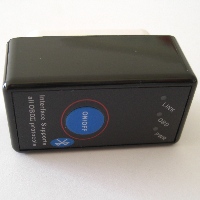
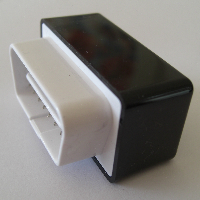
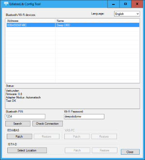

# Replacement firmware for ELM327
There is now a replacement firmware available for ELM327 based Bluetooth adapters, that has the following advantages over the standard firmware:
* Faster and more stable CAN communication.
* K-Line support (all protocols).
* New: Support for the VAG protocols KWP2000, KWP1281, TP2.0 (cars until 4.2012).
* Contains a bootstrap loader that allows firmware update without opening the device.
* Firmware updates are possible with _[Deep OBD for BMW and VAG](Deep_OBD_for_BMW_and_VAG.md)_.
* Reduced power consumption due to use of sleep mode.
* Two firmware versions are available:
  * Unmodified Bluetooth adapter: Baud rate 38400.
  * Modified Bluetooth adapter (recommended) with replaced [OpenSource Bluetooth firmware](Custom_Bluetooth_firmware.md): Baud rate 115200 and alterable Bluetooth pin (16 digits) and name (31 chars).

 

## Buy an adapter
New adapters are available.  
You could buy the [Bluetooth adapter](http://www.ebay.de/itm/253260261614) from EBAY.  
For BMW F-models use the [ENET WiFi Adapter](ENET_WiFi_Adapter.md).

## Factory reset
Beginning with firmware version 0.6 there is the possibility to perform a factory reset of the adapter. This resets the Bluetooth pin to 1234, the Bluetooth name to Deep OBD BMW and the mode to D-CAN.  
To perform the factory reset you have to open the adapter and connect the unused pad of R26 with GND during power on.

## Use the adapter with INPA, Tool32 or ISTA-D
You could use the Bluetooth adapter on a windows PC with INPA, Tool32 or ISTA-D as a replacement for an OBD or ADS adapter. The following steps are required to establish the connection:
* Install [.NET framework 4.0](https://www.microsoft.com/de-de/download/details.aspx?id=17718) or higher and [VS2015 C++ runtime](https://www.microsoft.com/de-de/download/details.aspx?id=48145) (recommended, but not required)
* Download the latest _Binary_ package and extract the .zip file. Start `Api32\EdiabasLibConfigTool.exe` and follow the instructions in the status window: Search the adapter, select it, click `Check Connection` and patch the required EDIABAS installations.
* For ISTA-D: You have to select the `EDIABAS\bin` directory inside ISTA-D first.
* For ISTA-D: In _Administration_ -> `VCI Config` select as `Interface type`: `Ediabas default settings (ediabas.ini)`

## Programming of the processor
For the first programming of the processor simply attach a PICKit 3 programmer to the corresponding test points of the circuit board.  
The source for the firmware could be found in the subdirectory `CanAdapterElm`. The subdirectory names below are the Bluetooth chip types:
* `default`: Unmodified ELM327 Bluetooth chip (Baud rate 38400)
* `bc04`: BC-04 Bluetooth chip with BK3231 processor
* `hc04`: HC-04 Bluetooth chip with BC417 processor
* `spp_uart`: [OpenSource Bluetooth firmware](Custom_Bluetooth_firmware.md) with BC417 processor
  * `spp_uart.xpv` and `spp_uart.xdv`: Firmware for BC417b processor
  * `usbspi.dll`: Driver for programming the BC417b processor. For more information see the [`ReadMe.txt`](../EdiabasLib/CanAdapterElm/Bluetooth/spp_uart/ReadMe.txt) file.

There are two firmware files, the complete file (`CanAdapterElm.X.production.unified.hex`) and the update file (`CanAdapterElm.X.production.hex`) without bootloader, that is only needed by _[Deep OBD for BMW and VAG](Deep_OBD_for_BMW_and_VAG.md)_.  
The latest firmware version will be always included in _[Deep OBD for BMW and VAG](Deep_OBD_for_BMW_and_VAG.md)_.
